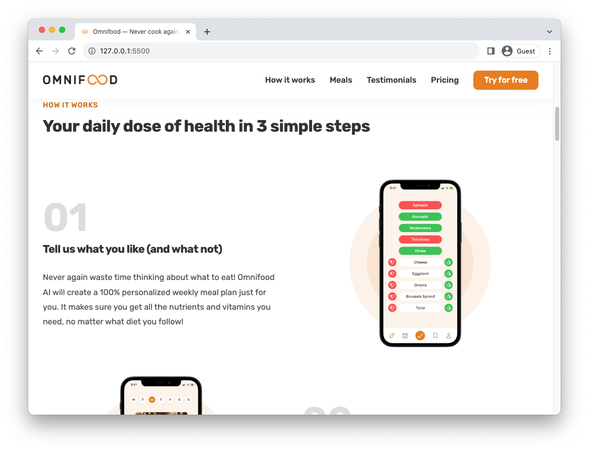

# Omnifood - Restaurants landing page

**Omnifood** is a website designed to introduce and promote an AI-powered food subscription service. The website is responsive and designed to work on various devices and screen sizes. Users can learn about the service, its features, pricing, and testimonials from satisfied customers.

## Demo

[Omnifood](https://omnifoodlanding.vercel.app/)

## Screenshots

## Technologies Used

- HTML
- CSS
- CSS Grid
- CSS Flexbox
